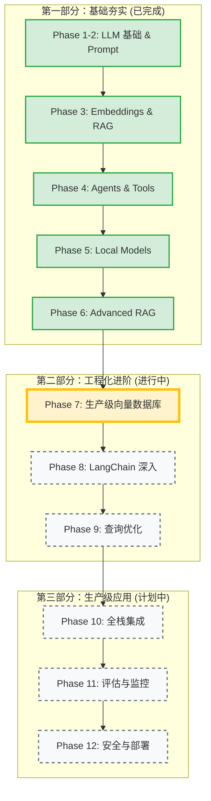

# 🗺️ LLM Developer Learning Roadmap

> **当前状态**: 🚀 正在进入第 7 阶段 (生产级向量数据库)
> **总体进度**: 50% (完成 6/12 阶段)

## 📅 学习路径概览

---

## 📍 详细里程碑

### ✅ 第一部分：基础夯实 (Phase 1-6)

这一部分建立了 LLM 开发的核心概念和基础技能。

- **Phase 1-2**: 掌握了 API 调用、Prompt Engineering、CoT 思维链。
- **Phase 3**: 理解了向量化 (Embeddings) 和基础 RAG 原理。
- **Phase 4**: 构建了能够使用工具 (Function Calling) 的 Agent。
- **Phase 5**: 实现了 Ollama 本地模型部署和运行。
- **Phase 6**: 深入了 LanceDB、混合检索 (Hybrid Search) 和重排序 (Re-ranking)。

### 🚧 第二部分：工程化进阶 (Phase 7-9)

重点在于将 Demo 级别的代码转化为生产级可用的系统。

#### 👉 Phase 7: 生产级向量数据库 (当前阶段)

- [ ] **Pinecone**: 云端向量库集成与 RAG Pipeline
- [ ] **Weaviate**: Docker 部署与混合检索
- [ ] **优化**: HNSW 参数调优与性能测试
- [ ] **实战**: 个人知识库系统 v1

#### Phase 8: LangChain 生态深入

- [ ] LCEL (LangChain Expression Language)
- [ ] Memory 管理与持久化
- [ ] 高级 Retriever 与 Multi-Agent 模式

#### Phase 9: 查询优化与高级检索

- [ ] HyDE (假设性文档嵌入)
- [ ] 查询分解与 RAG Fusion
- [ ] Cross-Encoder 高级重排序

### 🔮 第三部分：生产级应用 (Phase 10-12)

关注全栈应用开发、质量保证和运维部署。

#### Phase 10: 前端集成与流式响应

- [ ] Next.js + Vercel AI SDK
- [ ] 多模态 (视觉/语音) 支持
- [ ] **实战**: AI 客服系统

#### Phase 11: 评估、监控与优化

- [ ] RAGAS 自动化评估框架
- [ ] LangSmith 链路追踪
- [ ] A/B 测试

#### Phase 12: 安全、成本与生产部署

- [ ] Prompt 注入防护与内容审核
- [ ] 缓存策略与成本优化
- [ ] **实战**: 企业级文档问答系统

---

## 🏆 实战项目规划

| 项目             | 对应阶段 | 核心技术点                       | 状态      |
| :--------------- | :------- | :------------------------------- | :-------- |
| **个人知识库**   | Phase 7  | PDF 解析, 混合检索, 元数据过滤   | ⏳ 待启动 |
| **AI 客服系统**  | Phase 10 | Next.js, Vercel AI SDK, 流式响应 | ⏳ 规划中 |
| **企业文档问答** | Phase 12 | 多租户, 权限控制, 完整运维体系   | ⏳ 规划中 |

---

> _此路线图基于 `LLM_DEVELOPER_PLAN.md` 自动生成，随学习进度动态更新。_
