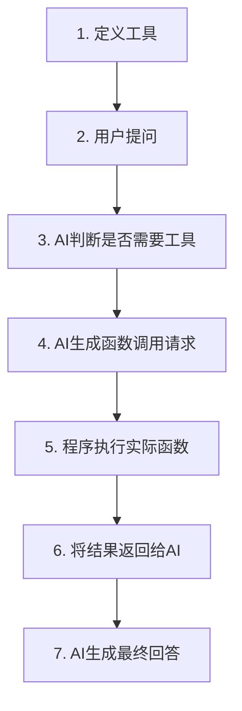

# Phase 5: Agents & Function Calling - 学习总结

## 📚 本章概述

**Agents（智能体）**和 **Function Calling（函数调用）**是 AI 应用的革命性突破，让 AI 从"被动回答"进化为"主动行动"。

**核心突破：**

> AI 不再只是回答问题，而是能够调用工具、访问数据、执行操作，成为真正的智能助手。

---

## 🎯 核心知识点回顾

### 1. 什么是 AI Agent？

**传统 LLM vs AI Agent：**

| 传统 LLM         | AI Agent         |
| ---------------- | ---------------- |
| 只能对话         | 能够行动         |
| "我无法查询天气" | 自动调用天气 API |
| 被动回答         | 主动执行         |
| 静态知识         | 动态数据访问     |

**示例对比：**

```
❌ 传统LLM:
用户: "北京今天天气怎么样？"
AI: "抱歉，我无法获取实时天气信息..."

✅ AI Agent:
用户: "北京今天天气怎么样？"
AI: [调用 get_weather("北京")]
AI: "北京今天晴天，温度15度，空气质量良好。"
```

---

### 2. Function Calling 工作原理

**完整流程（7 步）：**



**关键步骤详解：**

**步骤 1：定义工具**

```typescript
const tools = [
  {
    functionDeclarations: [
      {
        name: "get_weather",
        description: "获取城市天气信息", // ← AI根据这个决定何时调用
        parameters: {
          type: SchemaType.OBJECT,
          properties: {
            city: {
              type: SchemaType.STRING,
              description: "城市名称", // ← 帮助AI提取参数
            },
          },
        },
      },
    ],
  },
];
```

**步骤 3-4：AI 决策并生成调用**

```json
// AI分析："这需要实时天气数据，我应该调用 get_weather"
{
  "name": "get_weather",
  "arguments": { "city": "北京" }
}
```

**步骤 5-6：执行并返回**

```typescript
const result = getWeather("北京");
// { temperature: 20, condition: "晴天" }
```

---

### 3. Function Calling vs 传统编程

| 对比维度     | 传统编程                      | Function Calling      |
| ------------ | ----------------------------- | --------------------- |
| **决策者**   | 程序员写死逻辑                | AI 智能决策           |
| **参数提取** | 固定的 if-else                | AI 理解自然语言       |
| **灵活性**   | 需要枚举所有情况              | 理解各种表达          |
| **示例**     | `if (input.contains("天气"))` | AI 理解"帝都今天冷吗" |

**代码对比：**

**传统方式：**

```typescript
if (input.includes("天气") && input.includes("北京")) {
  getWeather("北京");
} else if (input.includes("天气") && input.includes("上海")) {
  getWeather("上海");
}
// 需要处理无数种组合...😫
```

**Function Calling：**

```typescript
// AI自动理解并调用！✨
"北京天气" → get_weather("北京")
"帝都今天冷吗" → get_weather("北京")
"BJ的温度" → get_weather("北京")
```

---

### 4. 工具定义最佳实践

**JSON Schema 格式：**

```typescript
{
  name: 'calculator',              // 函数名（必须）
  description: '执行数学计算',     // 何时使用（关键！）
  parameters: {
    type: SchemaType.OBJECT,
    properties: {
      expression: {
        type: SchemaType.STRING,
        description: '数学表达式，如"2+3"'  // 帮助AI理解
      }
    },
    required: ['expression']       // 必需参数
  }
}
```

**关键原则：**

1. **description 极其重要** - AI 靠它决定何时调用
2. **参数描述要清晰** - 帮助 AI 正确提取
3. **避免复杂枚举** - Gemini 对 NUMBER 枚举有限制

---

## 💻 代码示例回顾

### 示例 1：基础 Function Calling

**文件：** [src/08-function-calling-basics.ts](file:///Users/perlou/Desktop/personal/go-blog/ai-learning-ts/src/08-function-calling-basics.ts)

**演示内容：**

- 定义两个工具：天气查询、计算器
- AI 自动选择合适的工具
- 处理工具调用和响应

**关键代码：**

```typescript
// 正确访问 function calls
const candidate = response.candidates?.[0];
const parts = candidate?.content?.parts || [];
const functionCallPart = parts.find((part) => part.functionCall);

if (functionCallPart?.functionCall) {
  const fc = functionCallPart.functionCall;
  // 执行函数...
}
```

**运行：**

```bash
npx tsx src/08-function-calling-basics.ts
```

---

### 示例 2：实用天气助手

**文件：** [src/09-weather-agent.ts](file:///Users/perlou/Desktop/personal/go-blog/ai-learning-ts/src/09-weather-agent.ts)

**演示内容：**

- 多个工具：当前天气、天气预报
- 多轮对话支持
- 基于上下文的智能推理

**特性：**

```
用户: "北京今天天气怎么样？"
AI: [调用 get_current_weather("北京")]

用户: "温度适合穿什么？"  ← 基于之前的天气信息
AI: "15度建议穿长袖..."
```

**运行：**

```bash
npx tsx src/09-weather-agent.ts
```

---

### 示例 3：多工具智能助手

**文件：** [src/10-multi-tool-agent.ts](file:///Users/perlou/Desktop/personal/go-blog/ai-learning-ts/src/10-multi-tool-agent.ts)

**可用工具：**

- 🧮 计算器
- 🕐 时间查询（多时区）
- 🔄 单位转换
- 🔍 知识搜索

**复杂任务示例：**

```
用户: "如果我在上海买了100米布料，重50公斤，运到纽约。
     请告诉我：1) 布料是多少英尺？2) 重量是多少磅？3) 现在纽约几点？"

AI 自动规划:
1. convert_units(100, "meter", "feet")
2. convert_units(50, "kg", "lb")
3. get_current_time("America/New_York")
4. 综合回答
```

**运行：**

```bash
npx tsx src/10-multi-tool-agent.ts
```

---

### 调试示例：Function Calling 测试

**文件：** [src/test-function-calling.ts](file:///Users/perlou/Desktop/personal/go-blog/ai-learning-ts/src/test-function-calling.ts)

**用途：**

- 验证 Function Calling 是否正常工作
- 查看完整的调用流程
- 调试工具定义问题

**输出示例：**

```
✅ Function Calling 被触发！
函数名: get_weather
参数: { "city": "北京" }
🔧 执行函数，返回: { "temperature": 15, "condition": "晴天" }
🤖 AI 最终回复: 北京今天晴天，15度。
```

---

## 🔧 实际应用场景

### 1. 数据查询助手

```typescript
// 查询数据库、生成报表
tools = [
  { name: 'query_database', ... },
  { name: 'generate_chart', ... }
]

用户: "显示上个月销售额前10的产品"
AI: [查询数据库] → [生成图表] → 回复
```

### 2. 客服机器人

```typescript
tools = [
  { name: '查询订单', ... },
  { name: '申请退款', ... },
  { name: '物流跟踪', ... }
]

用户: "我的订单什么时候发货？"
AI: [查询订单] → "您的订单已于今天发货..."
```

### 3. 代码助手

```typescript
tools = [
  { name: '执行代码', ... },
  { name: '搜索文档', ... },
  { name: '生成测试', ... }
]
```

### 4. 自动化工作流

```typescript
tools = [
  { name: '发送邮件', ... },
  { name: '创建日程', ... },
  { name: '生成报告', ... }
]
```

---

## ⚠️ 重要注意事项

### 1. AI 不保证 100%正确

- 可能选错工具
- 可能提取错参数
- **必须验证关键操作**

### 2. 安全性考虑

```typescript
// ❌ 危险：直接暴露删除功能
{ name: 'delete_all_data', ... }

// ✅ 安全：添加确认和权限
async function deleteData(confirm: boolean, adminKey: string) {
  if (!confirm || adminKey !== SECRET) return;
  // 执行删除...
}
```

### 3. 成本控制

- 每次工具调用 = 额外的 API 请求
- 复杂任务可能需要多轮对话
- 监控和限制调用次数

### 4. 错误处理

```typescript
function executeFunction(fc: any) {
  try {
    const result = actualFunction(fc.args);
    return { success: true, data: result };
  } catch (error) {
    return { success: false, error: error.message };
  }
}
```

---

## 🎓 关键收获总结

### Function Calling 的价值

**技术价值：**

- 🔗 连接 AI 与真实世界数据
- 🤖 让 AI 具备执行能力
- 🧠 智能意图理解和任务规划

**商业价值：**

- 💼 自动化客服和支持
- 📊 智能数据分析
- ⚡ 提高工作效率

### 从对话到行动的演进

```
Phase 1-2: 理解 AI 和提示词
         ↓
Phase 3-4: 构建对话应用
         ↓
Phase 5: AI 成为行动者  ← 我们在这里！
         ↓
未来: 自主 AI Agent
```

---

## 📊 支持 Function Calling 的模型

| 模型             | 支持情况    | API 关键字             |
| ---------------- | ----------- | ---------------------- |
| **Gemini 2.0**   | ✅ 完全支持 | `functionDeclarations` |
| **GPT-4/GPT-4o** | ✅ 完全支持 | `tools`                |
| **Claude 3.5**   | ✅ Tool Use | `tools`                |
| **Llama 3.1+**   | ✅ 支持     | `tools`                |

---

## 🚀 下一步建议

1. **实践项目**

   - 构建自己的工具集
   - 集成真实 API（天气、股票等）
   - 创建实用的 Agent

2. **深入学习**

   - LangChain.js 框架
   - 向量数据库集成
   - 本地 LLM（Ollama）

3. **探索高级话题**
   - Multi-Agent 系统
   - 自主规划和执行
   - Agent 评估和优化

---

**恭喜完成 Phase 5！🎉**  
你现在已经掌握了 AI 应用开发的核心技能，从基础概念到实际应用，可以构建真正有用的智能助手了！
