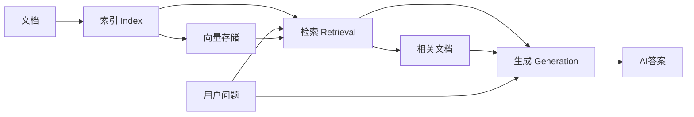

# 第 3 阶段学习总结：Embeddings 与 RAG

> **本阶段目标**：理解文本向量化原理，掌握向量相似度计算，实现基础的 RAG 系统

---

## 📚 核心知识点

### 一、Embeddings（文本向量化）

#### 1.1 什么是 Embeddings？

**定义**：将文本转换为高维向量（一组数字），使得语义相似的文本在向量空间中距离更近。

**示例**：

```
"Cat"     → [0.23, -0.45, 0.12, ...] (768 维向量)
"Dog"     → [0.25, -0.42, 0.15, ...] (相近)
"Apple"   → [-0.89, 0.67, -0.23, ...] (较远)
```

**核心原理**：

- 语义相似 = 向量距离近
- "猫" 和 "狗" 都是动物 → 向量相似
- "猫" 和 "苹果" 无关 → 向量差异大

#### 1.2 为什么需要 Embeddings？

**传统关键词匹配的问题**：

```
用户搜索："手机"
文档内容："移动电话、smartphone"

传统方法：❌ 找不到（关键词不匹配）
Embeddings：✅ 能找到（语义相似）
```

**Embeddings 的优势**：

- ✅ 理解同义词（"汽车" ≈ "轿车" ≈ "车辆"）
- ✅ 理解概念关联（"水果" 能找到 "苹果"、"香蕉"）
- ✅ 跨语言理解（不同语言的相似概念向量接近）
- ✅ 支持语义搜索

#### 1.3 Embeddings 模型

**常用模型**：

- **Gemini**: `text-embedding-004` (768 维)
- **OpenAI**: `text-embedding-3-small` (1536 维)
- **开源**: BGE、M3E、Sentence-Transformers

**使用方式**：

```typescript
const model = genAI.getGenerativeModel({
  model: "text-embedding-004",
});

const result = await model.embedContent("Cat");
const vector = result.embedding.values; // [0.23, -0.45, ...]
console.log(vector.length); // 768
```

---

### 二、向量相似度计算

#### 2.1 欧几里得距离（Euclidean Distance）

**公式**：

```
distance = √((v1[0]-v2[0])² + (v1[1]-v2[1])² + ...)
```

**特点**：

- 距离**越小**越相似
- 直观易懂
- 受向量长度影响

**代码**：

```typescript
function euclideanDistance(v1: number[], v2: number[]) {
  return Math.sqrt(
    v1.reduce((sum, val, i) => sum + Math.pow(val - (v2[i] || 0), 2), 0)
  );
}
```

#### 2.2 余弦相似度（Cosine Similarity）⭐ 推荐

**公式**：

```
similarity = (v1 · v2) / (|v1| × |v2|)
```

**特点**：

- 范围：-1 到 1（通常在 0 到 1）
- **值越大**越相似
- 不受向量长度影响，只看方向
- **生产环境首选**

**代码**：

```typescript
function cosineSimilarity(v1: number[], v2: number[]) {
  const dotProduct = v1.reduce((sum, val, i) => sum + val * (v2[i] || 0), 0);
  const mag1 = Math.sqrt(v1.reduce((sum, val) => sum + val * val, 0));
  const mag2 = Math.sqrt(v2.reduce((sum, val) => sum + val * val, 0));
  return dotProduct / (mag1 * mag2);
}
```

**比较**：
| 方法 | 值范围 | 越相似 | 推荐程度 |
|------|--------|--------|----------|
| 欧几里得距离 | 0 ~ ∞ | 越小 | 适合演示 |
| 余弦相似度 | -1 ~ 1 | 越大 | ⭐ 生产首选 |

---

### 三、RAG（检索增强生成）

#### 3.1 什么是 RAG？

**RAG = Retrieval-Augmented Generation**

**核心思想**：在生成答案前，先从知识库中检索相关信息。

**解决的问题**：

- ❌ **幻觉（Hallucination）**：LLM 编造不存在的信息
- ❌ **知识过时**：训练数据不包含最新信息
- ❌ **私有数据**：LLM 不知道你的个人/公司数据

**RAG 的价值**：

- ✅ 基于真实数据回答，减少幻觉
- ✅ 可以实时更新知识库
- ✅ 支持私有数据查询
- ✅ 可追溯答案来源

#### 3.2 RAG 的三个阶段



**第一阶段：索引（Indexing）**

- 将知识库文档转换为 Embeddings
- 存储到向量数据库

```typescript
const knowledgeBase = [
  "Perlou 最喜欢的食物是宫保鸡丁。",
  "Perlou 的猫叫 'Luna'。",
];

for (const text of knowledgeBase) {
  const result = await embeddingModel.embedContent(text);
  vectorStore.push({
    content: text,
    embedding: result.embedding.values,
  });
}
```

**第二阶段：检索（Retrieval）**

1. 将用户问题转换为 Embedding
2. 计算与知识库的相似度
3. 返回最相关的文档

```typescript
// 问题向量化
const queryVector = await embeddingModel.embedContent(query);

// 计算相似度并排序
const rankedDocs = vectorStore
  .map((doc) => ({
    ...doc,
    score: cosineSimilarity(queryVector, doc.embedding),
  }))
  .sort((a, b) => b.score - a.score); // 降序

// 取 Top 1
const bestMatch = rankedDocs[0];
```

**第三阶段：生成（Generation）**

- 将检索到的文档作为上下文
- 构造 Prompt
- LLM 基于上下文生成答案

```typescript
const prompt = `
你是一个智能助手。请根据下面的上下文信息回答用户的问题。
如果上下文中没有答案，请诚实地说不知道。

上下文信息:
${bestMatch.content}

用户问题:
${query}
`;

const result = await chatModel.generateContent(prompt);
```

#### 3.3 RAG vs 纯 LLM

| 维度         | 纯 LLM      | RAG                  |
| ------------ | ----------- | -------------------- |
| **知识来源** | 训练数据    | 知识库 + 训练数据    |
| **准确性**   | 可能幻觉    | 基于真实数据         |
| **时效性**   | 训练时间点  | 实时更新             |
| **私有数据** | 不支持      | ✅ 支持              |
| **答案溯源** | ❌ 无法追溯 | ✅ 可以引用原文      |
| **成本**     | 低          | 稍高（需要向量检索） |

---

## 💻 代码示例总结

### 示例 1：Embeddings 基础（01-embeddings.ts）

**学习要点**：

- ✅ 使用 `text-embedding-004` 模型
- ✅ 生成文本向量
- ✅ 计算向量距离
- ✅ 验证语义相似性

**核心流程**：

```typescript
// 1. 获取 Embedding 模型
const model = genAI.getGenerativeModel({
  model: "text-embedding-004",
});

// 2. 生成向量
const result = await model.embedContent("Cat");
const vector = result.embedding.values;

// 3. 计算相似度
const d1 = euclideanDistance(catVector, dogVector);
const d2 = euclideanDistance(catVector, appleVector);

// 4. 验证
if (d1 < d2) {
  console.log("猫和狗更相似！");
}
```

**关键发现**：

- 向量维度：768 维
- Cat 和 Dog 距离小（语义相似）
- Cat 和 Apple 距离大（语义不同）

---

### 示例 2：简单 RAG 实现（02-simple-rag.ts）

**学习要点**：

- ✅ 构建知识库索引
- ✅ 向量相似度检索
- ✅ 上下文注入
- ✅ 完整 RAG 流程

**核心架构**：

```typescript
// 1. 知识库
const knowledgeBase = [
  "Perlou 最喜欢的食物是宫保鸡丁。",
  "Perlou 的猫叫 'Luna'。",
  // ...
];

// 2. 索引
for (const text of knowledgeBase) {
  const embedding = await embeddingModel.embedContent(text);
  vectorStore.push({ content: text, embedding });
}

// 3. 检索
const queryVector = await embeddingModel.embedContent(query);
const bestMatch = findMostSimilar(queryVector, vectorStore);

// 4. 生成
const prompt = buildPromptWithContext(bestMatch.content, query);
const answer = await chatModel.generateContent(prompt);
```

**实际效果**：

```
问题："Perlou 的猫叫什么？"
→ 检索到："Perlou 的猫叫 'Luna'。"
→ AI 回答："Perlou 的猫叫 Luna。"
```

---

## 🎯 RAG 系统设计要点

### 1. 知识库设计

**粒度选择**：

```
❌ 太粗：整篇文章作为一个文档 → 检索不精确
✅ 适中：按段落或主题分割 → 平衡性能和精度
❌ 太细：每句话一个文档 → 上下文碎片化
```

**元数据添加**：

```typescript
interface Document {
  content: string;
  embedding: number[];
  metadata: {
    source: string; // 来源
    timestamp: Date; // 时间
    category: string; // 分类
  };
}
```

### 2. 检索策略

**Top-K 选择**：

```typescript
// 返回 Top 3 最相关文档
const topDocs = rankedDocs.slice(0, 3);
```

**相似度阈值**：

```typescript
// 过滤低相似度文档
const relevantDocs = rankedDocs.filter((doc) => doc.score > 0.7);
```

### 3. Prompt 设计

**好的 RAG Prompt**：

```typescript
const prompt = `
你是一个专业的助手。请基于以下上下文回答问题。

重要规则：
1. 只使用上下文中的信息
2. 如果上下文中没有答案，请说"我不知道"
3. 不要编造信息

上下文：
${context}

问题：
${query}

回答：
`;
```

---

## 🔄 常见问题与解决方案

### Q1: Embeddings 太慢怎么办？

**解决方案**：

- 批量处理：一次生成多个 Embedding
- 缓存：相同文本不重复计算
- 异步并发：使用 `Promise.all`

```typescript
// 批量处理
const results = await Promise.all(
  texts.map((text) => embeddingModel.embedContent(text))
);
```

### Q2: 检索结果不准确？

**解决方案**：

- 增加 Top-K 数量
- 优化文档分割粒度
- 使用更好的 Embedding 模型
- 添加元数据过滤

### Q3: 知识库太大，检索太慢？

**解决方案**：

- 使用向量数据库（Pinecone、Weaviate）
- 使用近似最近邻（ANN）算法
- 分层检索：先粗筛再精排

### Q4: LLM 不遵循上下文？

**解决方案**：

- 强化 Prompt 约束
- 提高相似度阈值
- 使用更强大的模型

---

## ✅ 本阶段核心要点

1. **Embeddings**：文本 → 向量，语义相似 = 向量接近
2. **余弦相似度**：生产环境首选的相似度计算方法
3. **RAG 三阶段**：索引 → 检索 → 生成
4. **RAG 价值**：减少幻觉、支持私有数据、可追溯来源
5. **基础实现**：内存向量存储 + 相似度排序

---

## 📈 下一步学习建议

1. **实践项目**：

   - 构建个人笔记问答系统
   - 为公司文档建立 RAG 索引

2. **深入学习**：

   - 向量数据库（LanceDB、Pinecone）
   - 高级检索技术（混合检索、重排序）
   - 文档分割策略

3. **优化方向**：
   - 提升检索精度
   - 降低延迟
   - 优化成本

**恭喜你完成第 3 阶段的学习！** 🎉

你已经掌握了 Embeddings 和 RAG 的核心原理，可以构建基础的智能问答系统了。

👉 **下一步**：进入[第 4 阶段](../phase-4-agents/README.md)学习 Agent 开发！
