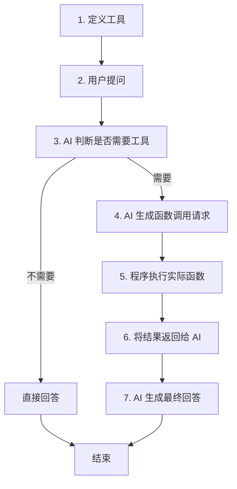

# 第 4 阶段学习总结：Agents 与 Function Calling

> **本阶段目标**：理解 Agent 的工作原理，掌握 Function Calling 技术，构建能够使用工具的智能 Agent

---

## 📚 核心知识点

### 一、从对话到行动：Agent 的革命性突破

#### 1.1 传统 LLM vs AI Agent

**传统 LLM 的局限**：

```
用户："北京今天天气怎么样？"
LLM："抱歉，我无法获取实时天气信息..."
```

❌ 只能对话，无法执行操作

**AI Agent 的能力**：

```
用户："北京今天天气怎么样？"
Agent: [调用 get_weather("北京")]
Agent: "北京今天晴天，温度 15°C，空气质量良好。"
```

✅ 能够主动调用工具、执行操作

**核心区别**：

| 维度         | 传统 LLM     | AI Agent             |
| ------------ | ------------ | -------------------- |
| **能力**     | 只能对话     | 对话 + 行动          |
| **数据获取** | 仅限训练数据 | 实时 API 调用        |
| **工具使用** | 不支持       | ✅ 支持              |
| **应用场景** | 问答、写作   | 自动化任务、数据查询 |

---

### 二、Function Calling 工作原理

#### 2.1 什么是 Function Calling？

**定义**：让 LLM 能够智能地决定何时调用哪个函数，并提取正确的参数。

**核心要素**：

1. **工具定义**：告诉 LLM 有哪些函数可用
2. **智能决策**：LLM 判断是否需要调用工具
3. **参数提取**：从用户输入中提取函数参数
4. **函数执行**：实际调用函数获取结果
5. **结果整合**：将函数结果融入回答

#### 2.2 完整流程（7 步骤）



**详细说明**：

**步骤 1：定义工具**

```typescript
const tools = [
  {
    functionDeclarations: [
      {
        name: "get_weather",
        description: "获取指定城市的天气信息", // ← 关键！AI 根据这个决定何时调用
        parameters: {
          type: SchemaType.OBJECT,
          properties: {
            city: {
              type: SchemaType.STRING,
              description: "城市名称，如'北京'、'上海'",
            },
          },
          required: ["city"],
        },
      },
    ],
  },
];
```

**步骤 3-4：AI 决策并生成调用**

```json
// AI 的内部决策过程（简化）
{
  "分析": "用户问天气 → 需要实时数据 → 应该调用 get_weather",
  "函数调用": {
    "name": "get_weather",
    "arguments": { "city": "北京" }
  }
}
```

**步骤 5-6：执行并返回**

```typescript
// 你的代码实际执行函数
const result = getWeather("北京");
// { temperature: 15, condition: "晴天" }

// 将结果返回给 AI
```

**步骤 7：AI 生成回答**

```
AI: "北京今天晴天，温度 15°C。"
```

---

### 三、工具定义的最佳实践

#### 3.1 JSON Schema 格式

```typescript
{
  name: "calculator",                    // 函数名（必须）
  description: "执行数学计算，如加减乘除", // 何时调用（关键！）
  parameters: {
    type: SchemaType.OBJECT,
    properties: {
      expression: {
        type: SchemaType.STRING,
        description: "数学表达式，如 '2+3*4'"
      }
    },
    required: ["expression"]            // 必需参数
  }
}
```

#### 3.2 Description 的重要性

**description 是 AI 决策的关键！**

❌ **糟糕的 description**：

```typescript
description: "获取天气"; // 太模糊
```

✅ **优秀的 description**：

```typescript
description: "获取指定城市的实时天气信息，包括温度、天气状况和空气质量";
```

**原则**：

- 明确说明**何时**使用这个工具
- 描述工具能提供的**具体信息**
- 给出**使用场景**示例

#### 3.3 参数类型支持

| 类型   | SchemaType | 示例           |
| ------ | ---------- | -------------- |
| 字符串 | STRING     | "北京"         |
| 数字   | NUMBER     | 42             |
| 布尔   | BOOLEAN    | true           |
| 数组   | ARRAY      | ["a", "b"]     |
| 对象   | OBJECT     | {name: "test"} |

**注意**：Gemini 对复杂枚举支持有限，建议在 description 中说明可选值。

---

### 四、Function Calling vs 传统编程

#### 4.1 智能决策的优势

**传统 if-else 方式**：

```typescript
// 需要枚举所有可能的表达方式
if (input.includes("天气") && input.includes("北京")) {
  getWeather("北京");
} else if (input.includes("天气") && input.includes("上海")) {
  getWeather("上海");
} else if (input.includes("温度") && input.includes("北京")) {
  getWeather("北京");
}
// ... 无穷无尽的组合 😫
```

**Function Calling 方式**：

```typescript
// AI 自动理解各种表达
"北京天气"      → get_weather("北京")
"帝都今天冷吗"  → get_weather("北京")
"BJ 的温度"     → get_weather("北京")
"首都气温如何"  → get_weather("北京")
```

✅ AI 智能理解同义词、缩写、口语化表达

#### 4.2 自然语言参数提取

**传统方式**：

```typescript
// 手动解析和提取
const city = extractCity(input); // 复杂的正则表达式
const date = extractDate(input);
```

**Function Calling**：

```typescript
// AI 自动提取
"明天北京和上海的天气"
→ { cities: ["北京", "上海"], date: "明天" }
```

✅ AI 理解上下文，准确提取参数

---

## 💻 代码示例总结

### 示例 1：Function Calling 基础（01-function-calling-basics.ts）

**学习要点**：

- ✅ 定义多个工具（天气、计算器）
- ✅ AI 自动选择合适的工具
- ✅ 处理 Function Call 响应
- ✅ 多轮对话支持

**工具定义示例**：

```typescript
const tools = [
  {
    functionDeclarations: [
      {
        name: "get_weather",
        description: "获取城市天气",
        parameters: {
          /* ... */
        },
      },
      {
        name: "calculator",
        description: "执行数学计算",
        parameters: {
          /* ... */
        },
      },
    ],
  },
];
```

**关键代码模式**：

```typescript
const model = genAI.getGenerativeModel({
  model: "gemini-2.0-flash-exp",
  tools: tools  // 传入工具定义
});

const result = await model.generateContent(prompt);
const part = result.response.candidates?.[0]?.content?.parts?.[0];

if (part.functionCall) {
  // 执行函数
  const funcResult = executeFu nction(part.functionCall);

  // 将结果返回给 AI
  const response = await model.generateContent([
    { functionResponse: { name: funcName, response: funcResult } }
  ]);
}
```

---

### 示例 2：天气助手 Agent（02-weather-agent.ts）

**学习要点**：

- ✅ 实用的天气查询工具
- ✅ 多轮对话历史管理
- ✅ 基于上下文的智能推理

**工具集**：

- `get_current_weather` - 当前天气
- `get_weather_forecast` - 未来天气预报

**智能对话示例**：

```
用户: "北京今天天气怎么样？"
AI: [调用 get_current_weather("北京")]
AI: "北京今天晴天，15°C。"

用户: "那明天呢？"  ← 基于上下文
AI: [调用 get_weather_forecast("北京", "明天")]
AI: "明天多云，12-18°C。"
```

**关键特性**：

- 上下文理解："那明天呢" AI 知道指的是北京
- 工具选择：自动区分当前/未来天气

---

### 示例 3：多工具智能助手（03-multi-tool-agent.ts）

**学习要点**：

- ✅ 多个工具协同工作
- ✅ 复杂任务自动分解
- ✅ 多步骤推理

**工具集**：

- 🧮 `calculator` - 数学计算
- 🕐 `get_current_time` - 多时区时间
- 🔄 `convert_units` - 单位转换
- 🔍 `search_knowledge` - 知识查询

**复杂任务示例**：

```
用户: "如果我在上海买了 100 米布料，重 50 公斤，运到纽约。
      请告诉我：1) 布料是多少英尺？2) 重量是多少磅？3) 现在纽约几点？"

AI 自动规划：
步骤 1: convert_units(100, "meter", "feet")      → 328.08 英尺
步骤 2: convert_units(50, "kg", "lb")            → 110.23 磅
步骤 3: get_current_time("America/New_York")     → 06:30 AM

AI 综合回答：
"100 米布料约等于 328.08 英尺，50 公斤约等于 110.23 磅。
 现在纽约时间是上午 6:30。"
```

**关键能力**：

- ✅ 任务分解：一个问题拆成三个工具调用
- ✅ 并行思考：同时处理多个子任务
- ✅ 结果整合：综合多个工具结果

---

## 🎯 Agent 开发的关键要点

### 1. 工具设计原则

**单一职责**：

```typescript
// ✅ 好：职责清晰
{ name: "get_weather", description: "获取天气" }
{ name: "get_time", description: "获取时间" }

// ❌ 坏：职责混合
{ name: "get_info", description: "获取天气或时间" }
```

**可组合性**：

```typescript
// 每个工具独立，可灵活组合
const weatherAgent = { tools: [get_weather] };
const fullAgent = { tools: [get_weather, get_time, calculator] };
```

### 2. 错误处理

**函数执行失败**：

```typescript
function executeFunction(fc: any) {
  try {
    const result = actualFunction(fc.args);
    return { success: true, data: result };
  } catch (error) {
    return {
      success: false,
      error: `执行失败: ${error.message}`,
    };
  }
}
```

**AI 可能犯的错误**：

- 选错工具
- 提取错参数
- 理解错意图

**应对策略**：

- 清晰的工具 description
- 验证函数参数
- 提供错误反馈给 AI

### 3. 安全性考虑

**危险操作保护**：

```typescript
// ❌ 危险：直接暴露删除功能
{ name: "delete_all_data", ... }

// ✅ 安全：添加确认机制
async function deleteData(confirm: boolean, adminKey: string) {
  if (!confirm || adminKey !== SECRET_KEY) {
    return "操作被拒绝：需要确认和管理员权限";
  }
  // 执行删除...
}
```

**敏感信息**：

- 不要在工具 description 中泄露敏感信息
- 验证用户权限
- 记录操作日志

### 4. 成本控制

**每次工具调用 = 额外的 API 请求**：

- 索引阶段：1 次（定义工具）
- 调用请求：1 次（AI 决定调用）
- 返回结果：1 次（生成最终答案）

**优化策略**：

- 合并相似工具
- 缓存常用结果
- 限制最大调用次数

---

## 🚀 实际应用场景

### 1. 智能客服

**工具集**：

- `query_order` - 查询订单
- `cancel_order` - 取消订单
- `track_shipment` - 物流跟踪
- `request_refund` - 申请退款

```
用户: "我的订单 12345 什么时候发货？"
AI: [query_order(12345)] → "您的订单已于昨天发货"
```

### 2. 数据分析助手

**工具集**：

- `query_database` - 查询数据库
- `generate_chart` - 生成图表
- `export_report` - 导出报告

```
用户: "显示上月销售额前 10 的产品"
AI: [query_database("SELECT...")] → [generate_chart(data)]
```

### 3. DevOps 自动化

**工具集**：

- `deploy_service` - 部署服务
- `check_logs` - 查看日志
- `restart_server` - 重启服务器

## ✅ 本阶段核心要点

1. **Agent = 对话 + 行动**：突破传统 LLM 的对话限制
2. **Function Calling**：让 AI 智能决策何时调用工具
3. **工具定义**：description 是关键，决定 AI 的决策
4. **智能优势**：自动理解同义词、提取参数、分解任务
5. **安全性**：验证权限、处理错误、控制成本

---

## 📈 下一步学习建议

1. **实践项目**：
   - 构建个人助手 Agent
   - 集成真实 API（天气、股票等）
2. **深入学习**：
   - ReAct Pattern（推理-行动循环）
   - Multi-Agent 系统
   - Agent 评估与优化

**恭喜完成第 4 阶段！** 🎉

你已经掌握了 Agent 开发的核心技能，可以构建能够执行实际操作的智能助手了！

👉 **下一步**：进入[第 5 阶段](../phase-5-local-models/README.md)学习本地模型运行！
