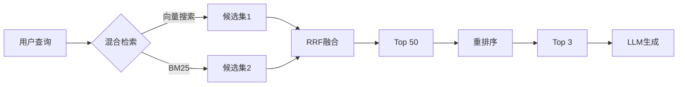

# 第 6 阶段：高级 RAG

## 🎯 学习目标

- 掌握 LanceDB 向量数据库的使用
- 理解混合检索（Hybrid Search）原理
- 实现重排序（Re-ranking）优化
- 构建生产级 RAG 管道

## 📚 文件列表

| 文件                   | 描述             | 关键概念                     |
| ---------------------- | ---------------- | ---------------------------- |
| `01-lancedb-basics.ts` | LanceDB 基础操作 | 向量数据库、持久化存储、索引 |
| `02-hybrid-search.ts`  | 混合检索实现     | BM25、向量搜索、RRF 融合     |
| `03-reranking.ts`      | 重排序优化       | Cross-Encoder、LLM 评分      |

## 🚀 运行方式

```bash
npx tsx src/phase-6-advanced-rag/01-lancedb-basics.ts
npx tsx src/phase-6-advanced-rag/02-hybrid-search.ts
npx tsx src/phase-6-advanced-rag/03-reranking.ts
```

## 💾 数据库设置

### 自动生成

首次运行任何脚本时，`.lancedb` 数据库会自动创建在项目根目录下的 `src/.lancedb/` 文件夹中：

```bash
# 首次运行会自动生成数据库
npx tsx src/phase-6-advanced-rag/01-lancedb-basics.ts
```

### 重新生成数据库

如果需要重新生成数据库（例如重置数据），只需删除现有数据库文件夹后重新运行：

```bash
# 删除现有数据库
rm -rf src/.lancedb

# 重新运行脚本生成新数据库
npx tsx src/phase-6-advanced-rag/01-lancedb-basics.ts
```

> **注意**：`.lancedb` 文件夹已添加到 `.gitignore`，不会被提交到版本控制系统。

## 📖 核心概念

### LanceDB

轻量级的向量数据库，支持：

- 🔄 持久化存储
- ⚡ 高效的 ANN 搜索
- 📊 SQL-like 查询
- 🔗 与 LangChain 无缝集成

### 混合检索（Hybrid Search）

**问题**：单纯的向量搜索有局限性

- ✅ 优势：理解语义（"手机" ≈ "移动电话"）
- ❌ 劣势：精确匹配差（搜 `ERR-502` 可能找到 `ERR-503`）

**解决方案**：结合关键词搜索（BM25）

```
最终结果 = RRF(向量搜索结果, BM25搜索结果)
```

### 重排序（Re-ranking）

**两阶段检索策略**：

1. **召回阶段**：快速检索 Top 50（向量搜索/混合搜索）
2. **重排序阶段**：精细打分 Top 3（Cross-Encoder/LLM）

**为什么需要？**

- Bi-Encoder（向量搜索）：查询和文档独立编码，速度快但精度一般
- Cross-Encoder（重排序）：同时看查询+文档，精度高但速度慢

### 生产级 RAG 管道



## 🔗 前置知识

- ✅ 第 3 阶段：基础 RAG
- ✅ 理解向量相似度
- ✅ 了解倒排索引（可选）

## 💡 关键指标

- **召回率（Recall）**：相关文档中，被检索出的比例
- **精确率（Precision）**：检索结果中，真正相关的比例
- **NDCG**：考虑排序质量的综合指标

## 📚 参考资源

- [LanceDB 文档](https://lancedb.github.io/lancedb/)
- [BM25 算法详解](https://www.elastic.co/blog/practical-bm25-part-2-the-bm25-algorithm-and-its-variables)
- [Two-Stage Retrieval 论文](https://arxiv.org/abs/2004.04906)

## 📖 阶段学习资料

- 📘 [advanced-rag.md](./advanced-rag.md) - 混合检索与重排序详细笔记
- 📝 [SUMMARY.md](./SUMMARY.md) - 本阶段完整学习总结（高级 RAG）
- ❓ [QUIZ.md](./QUIZ.md) - 阶段测验（选择题 + 代码题 + 场景题）

## ⏭️ 下一步

完成本阶段后，继续学习：
👉 [第 7 阶段：生产级向量数据库](../phase-7-production-vectors/README.md)（规划中）

查看完整学习计划：[LLM_DEVELOPER_PLAN.md](../../LLM_DEVELOPER_PLAN.md)
